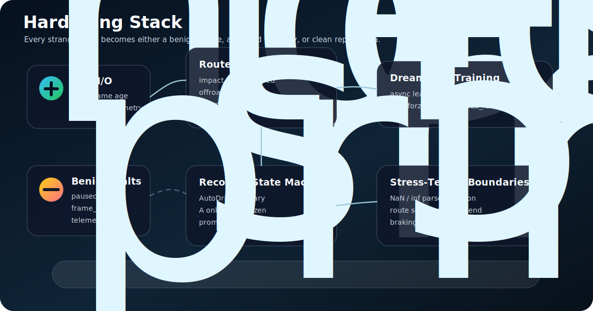

# Horizon FSD

<p align="center">
  
</p>

<p align="center">
  <a href="https://github.com/shoal-rat/Horizon_FSD/releases"></a>
  
  
  
  
</p>

Horizon FSD is a Windows research stack for vision-based autonomous driving in
Forza Horizon 6. It treats the game like a real-time robotics environment:
Windows screen capture is the camera, Forza Data Out UDP is telemetry, and a
virtual Xbox controller is the actuator.

The current stack uses DreamerV3 with warm-start replay, route-aware rewards,
strange-situation guards, and ANNA AutoDrive recovery demonstrations. It is built
for a real shared-GPU laptop workflow where FH6 and training contend for the same
8 GB GPU.

This repository contains code and documentation only. It intentionally excludes
recordings, replay buffers, checkpoints, `centerline.npy`, TensorBoard logs,
`.venv`, and the vendored `dreamerv3_torch/` checkout.

## Quick Links

- [DreamerV3 integration](docs/dreamer_integration.md)
- [Recovery mechanics](docs/recovery_mechanics.md)
- [Performance and hardening guide](docs/performance_and_hardening.md)
- [Driving RL notes](docs/driving_rl_lessons.md)
- [Telemetry format](docs/telemetry_format.md)
- [Release notes](CHANGELOG.md)

## Safety And Scope

- Use Offline Solo / Free Roam only.
- Do not run automated input online, in competitive modes, or for leaderboards.
- The code uses screen capture, UDP telemetry, and virtual gamepad input. It does
  not inject into, patch, or read the game process memory.
- Live training must be supervised. Early policies drive badly.
- You are responsible for following the game's EULA and Code of Conduct.

## What Is New In This Version

- Route-aware episode endings: `offroute`, `noprogress`, `route_complete`, plus
  existing impact/stuck/flipped/offroad detection.
- Hardened live loop for strange states:
  - stale telemetry ends the episode as `telemetry_lost`
  - paused/menu telemetry ends benignly as `paused`
  - frozen capture frames end benignly as `frame_lost`
  - teleport/fast-travel jumps are re-anchored instead of misread as crashes
  - long GPU-stall ticks are ignored for impact-rate checks
  - slow uphill crawling no longer trips the stuck detector if position advances
- AutoDrive recovery now models the FH6 split behavior:
  - far off-road -> Fast Travel Warning / transfer prompt -> `A` confirms teleport
  - on-road but stuck -> no prompt -> AutoDrive drives back
  - `A` is pressed only while the car is positionally frozen, so live AutoDrive is
    not canceled by button spam
- `forza_full` Dreamer config for larger world-model training when GPU headroom is
  available.
- Stress tests for NaNs, teleport jumps, route ends, reverse farming,
  slow-but-advancing motion, malformed packets, and detector edge cases.

## Visual Overview

<p align="center">
  
</p>

<p align="center">
  
</p>

## Architecture

```text
FH6 screen + Data Out UDP
        |
        v
capture.py + telemetry_receiver.py + forza_telemetry.py
        |
        v
forza_rl_env.py
  obs: image, speed, line
  action: steer, throttle, brake in Dreamer coordinates
  reward: centerline progress + safety penalties
  done: impact/stuck/flipped/offroad/offroute/noprogress/route_complete
        |
        v
DreamerV3 actor + async learner
        |
        v
gamepad.py -> virtual Xbox controller -> FH6
```

Recovery data flows back into replay:

```text
crash/offroute -> recovery.py -> ANNA AutoDrive
                          |-> smooth drive-back -> recovery-*.npz demo
                          |-> teleport jump     -> safety only, not learned
```

## Repository Layout

```text
Horizon_FSD/
  action_utils.py                 Dreamer <-> gamepad action mapping
  build_centerline.py             Build route centerline from recorded position
  capture.py                      Windows.Graphics.Capture wrapper + frame age
  centerline.py                   Route projection and arc-length utilities
  config.yaml                     Main runtime configuration
  dataset.py                      Recording filters and BC dataset builder
  forza_rl_env.py                 DreamerV3 live FH6 environment
  forza_telemetry.py              324-byte Data Out parser with finite checks
  gamepad.py                      Virtual Xbox 360 controller + atexit neutralizer
  make_warmstart.py               Recordings -> Dreamer replay episodes
  offline_pretrain_dreamer.py     Replay training without starting FH6
  racing_line.py                  Visual racing-line cue reader
  recovery.py                     Detector + AutoDrive recovery ladder
  recovery_demo.py                Save smooth recoveries as Dreamer replay
  reward.py                       Centerline-aware driving reward
  train_dreamer.py                Live Dreamer launcher, --config forza/forza_full
  docs/
    dreamer_integration.md
    recovery_mechanics.md
    performance_and_hardening.md
    driving_rl_lessons.md
    telemetry_format.md
  tests/
    test_stress.py and focused unit tests
```

## Requirements

- Windows 10/11.
- Forza Horizon 6 for PC with Data Out enabled.
- Python 3.13 was used locally; Python 3.10-3.13 should work for most project
  code, but native package wheels may vary.
- NVIDIA GPU recommended for DreamerV3.
- ViGEmBus driver for virtual controller input.

Install the base environment:

```powershell
cd C:\Horizon_FSD
python -m venv .venv
.\.venv\Scripts\python.exe -m pip install --upgrade pip
.\.venv\Scripts\python.exe -m pip install --no-cache-dir -r requirements.txt
```

For CUDA PyTorch, install the CUDA wheel before packages that depend on
`torch` / `torchvision`:

```powershell
.\.venv\Scripts\python.exe -m pip install torch==2.11.0 torchvision==0.26.0 --index-url https://download.pytorch.org/whl/cu126
.\.venv\Scripts\python.exe -m pip install timm==1.0.27 tensorboard==2.20.0
```

If `vgamepad` cannot connect, install ViGEmBus from the bundled package path or
from `https://github.com/nefarius/ViGEmBus/releases`.

## FH6 Setup

```text
Settings -> HUD and Gameplay -> Data Out
Data Out: On
IP Address: 127.0.0.1
Port: 9999
```

Use Offline Solo / Free Roam, damage None/Cosmetic, a stable camera view, and a
route waypoint pinned for ANNA AutoDrive recovery.

## Restore The DreamerV3 Vendor

`dreamerv3_torch/` is intentionally ignored. Recreate it after cloning:

```powershell
cd C:\Horizon_FSD
git clone https://github.com/NM512/dreamerv3-torch dreamerv3_torch
.\.venv\Scripts\python.exe -m pip install --no-cache-dir gym==0.26.2 ruamel.yaml einops
git -C dreamerv3_torch apply ..\patches\dreamerv3_torch_horizon.patch
```

The patch adds the Forza env bridge, async learner, tolerant checkpoint loading,
`forza` and `forza_full` configs, dynamic recovery-demo loading, train-lock
checkpoint snapshots, and CUDA benchmark settings.

## Validation

No-game tests:

```powershell
.\.venv\Scripts\python.exe -m unittest discover -s tests -v
```

Live checks:

```powershell
.\.venv\Scripts\python.exe telemetry_probe.py
.\.venv\Scripts\python.exe sweep_gamepad.py
.\.venv\Scripts\python.exe capture_preview.py
.\.venv\Scripts\python.exe reset_test.py --duration 600
```

## Training Workflow

1. Record demonstrations.

```powershell
.\.venv\Scripts\python.exe record.py --duration 600
.\.venv\Scripts\python.exe record.py --autodrive --duration 600
```

2. Build a centerline from a clean reference route.

```powershell
.\.venv\Scripts\python.exe build_centerline.py --session C:\Horizon_FSD\recordings\manual_YYYYMMDD_HHMMSS --out C:\Horizon_FSD\centerline.npy
```

3. Convert recordings to Dreamer warm-start replay.

```powershell
.\.venv\Scripts\python.exe make_warmstart.py --logdir C:\Horizon_FSD\dreamer_logs\forza
```

4. If VRAM is tight, close FH6 and pretrain offline.

```powershell
.\.venv\Scripts\python.exe offline_pretrain_dreamer.py --updates 200 --logdir C:\Horizon_FSD\dreamer_logs\forza
```

5. Run live training with the lean config.

```powershell
.\.venv\Scripts\python.exe train_dreamer.py --config forza --logdir C:\Horizon_FSD\dreamer_logs\forza
```

6. Use the larger config only after reducing FH6 GPU pressure.

```powershell
.\.venv\Scripts\python.exe train_dreamer.py --config forza_full --logdir C:\Horizon_FSD\dreamer_logs\forza
```

See `docs/performance_and_hardening.md` before an overnight `forza_full` run.

## Recovery Strategy

<p align="center">
  
</p>

The recovery ladder is built around the real FH6 behavior observed in play:
AutoDrive itself is both the road-center transfer prompt and the route-following
drive-back mechanism.

- The detector ends episodes early when the car leaves the route, stops making
  centerline progress, flips, hits something, or goes off-road.
- AutoDrive is primary. It needs a pinned waypoint.
- `A` is sent only while the car is frozen after opening AutoDrive, which targets
  the Fast Travel Warning prompt without canceling live AutoDrive.
- Smooth AutoDrive recoveries are replay demonstrations.
- Teleport jumps are accepted for safety but excluded from learned dynamics.
- Pause-menu Reset Car Position is only a last-resort fallback.

## Configuration Highlights

- `telemetry`: Data Out freshness and resume timeouts.
- `capture`: capture source and frozen-frame threshold.
- `detector`: offroad, offroute, noprogress, stuck and teleport thresholds.
- `rl_reward`: centerline progress and penalty weights.
- `rl_safety`: steering clamps and post-recovery grace.
- `reset`: AutoDrive prompt timing, retry, backoff and safety fallback.
- `recovery_demos`: smooth recovery replay recording.

## Public Repo Notes

Excluded from git:

- game recordings and replay episodes
- trained checkpoints
- `centerline.npy`
- TensorBoard logs
- `dreamerv3_torch/`
- Python virtual environments

No license file is included yet. Until one is added, standard GitHub default
copyright rules apply.
