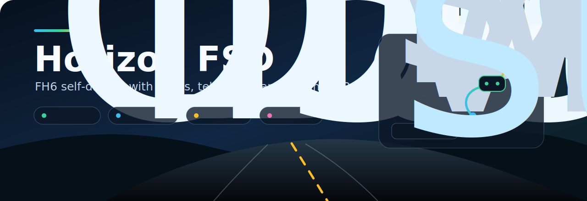
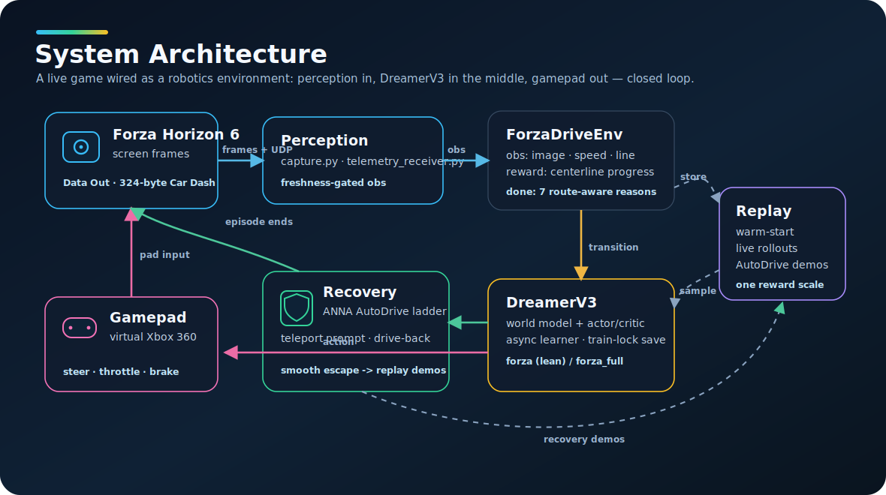
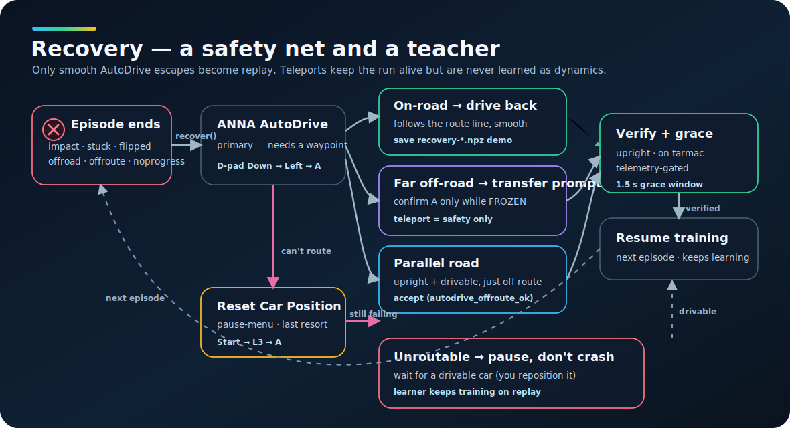

# Horizon FSD

<p align="center">
  
</p>

<p align="center">
  <a href="https://github.com/shoal-rat/Horizon_FSD/releases"></a>
  
  
  
</p>

Vision-based self-driving experiments for Forza Horizon 6 on Windows.

Horizon FSD wraps the game as a real-time reinforcement-learning environment:
screen pixels are observations, Forza Data Out UDP telemetry supplies speed,
position and reward signals, and a virtual Xbox controller sends steering,
throttle and brake commands. The current training path uses DreamerV3 with
warm-start replay, live recovery, and AutoDrive recovery demonstrations.

This repository is public for research and reproducibility. It does not include
recorded driving data, checkpoints, replay buffers, the Python virtual
environment, or the vendored DreamerV3 checkout.

## Quick Links

- [DreamerV3 integration](docs/dreamer_integration.md)
- [Driving RL notes](docs/driving_rl_lessons.md)
- [Telemetry format](docs/telemetry_format.md)
- [Release notes](CHANGELOG.md)
- [Recovery strategy](#recovery-strategy)
- [Training workflow](#training-workflow)

## Safety And Scope

- Run only in Offline Solo / Free Roam. Do not use this online, in competitive
  modes, or for leaderboards.
- This project sends automated controller input to a commercial game. Use it at
  your own risk and follow the game's EULA and Code of Conduct.
- The code uses only screen capture, UDP telemetry, and virtual gamepad input.
  It does not inject into, patch, or read the game process memory.
- The agent drives poorly during early training. Supervise live runs.

## Current Status

- Telemetry parser for the 324-byte Forza Horizon "Car Dash" packet.
- Windows.Graphics.Capture based screen capture.
- Virtual Xbox 360 controller output through `vgamepad` / ViGEmBus.
- Manual and ANNA/AutoDrive recording tools.
- Behavioral-cloning dataset and model utilities.
- DreamerV3 real-time environment:
  - observation: `image`, `speed`, `line`
  - action: steering, throttle, brake in Dreamer `[-1, 1]` coordinates
  - reward: centerline progress plus off-road, slip, spin, idle and action costs
  - crash/stuck/off-road detection
  - recovery ladder using rewind and ANNA AutoDrive
- AutoDrive recovery demonstrations:
  - smooth non-teleport recoveries are saved as Dreamer replay episodes
  - teleport/prompt recoveries are used for safety but not learned as dynamics

## Visual Overview

<p align="center">
  
</p>

The project is intentionally built around observable I/O: screen capture,
telemetry, and controller input. DreamerV3 learns from warm-start replay and live
episodes, while recovery demonstrations add examples of returning from off-route
states.

## Repository Layout

```text
Horizon_FSD/
  action_utils.py                 Dreamer <-> gamepad action mapping
  build_centerline.py             Build a route centerline from recorded position
  capture.py                      Windows.Graphics.Capture wrapper
  config.yaml                     Main runtime configuration
  dataset.py                      Recording filters and BC dataset builder
  forza_rl_env.py                 DreamerV3 live FH6 environment
  forza_telemetry.py              324-byte Data Out parser
  gamepad.py                      Virtual Xbox 360 controller wrapper
  make_warmstart.py               Recordings -> Dreamer replay episodes
  offline_pretrain_dreamer.py     Replay training without starting FH6
  patches/
    dreamerv3_torch_horizon.patch Vendored DreamerV3 changes
  racing_line.py                  Visual racing-line cue reader
  recovery.py                     Crash/stuck detection and recovery ladder
  recovery_demo.py                Save smooth AutoDrive recoveries as replay
  reward.py                       Driving reward
  train_dreamer.py                Live DreamerV3 launcher
  docs/
    dreamer_integration.md        DreamerV3 setup and patch details
    driving_rl_lessons.md         RL design notes and known risks
    telemetry_format.md           Data Out packet reference
  tests/                          Unit tests
```

Ignored local artifacts include:

```text
.venv/
dreamerv3_torch/
recordings/
dreamer_logs/
checkpoints/
runs/
*.npz, *.npy, *.pt, *.pth
```

## Requirements

- Windows 10/11.
- Forza Horizon 6 for PC with Data Out enabled.
- Python 3.13 was used on the development machine. Python 3.10-3.13 should work
  for most project code, but native package wheels may vary.
- NVIDIA GPU recommended for DreamerV3. The project was tuned for limited VRAM,
  including a workflow where FH6 is closed during offline pretraining.
- ViGEmBus driver for virtual controller input.

Install the base environment:

```powershell
cd C:\Horizon_FSD
python -m venv .venv
.\.venv\Scripts\python.exe -m pip install --upgrade pip
.\.venv\Scripts\python.exe -m pip install --no-cache-dir -r requirements.txt
```

For CUDA PyTorch, install the CUDA wheel before packages that depend on
`torch` / `torchvision`, for example:

```powershell
.\.venv\Scripts\python.exe -m pip install torch==2.11.0 torchvision==0.26.0 --index-url https://download.pytorch.org/whl/cu126
.\.venv\Scripts\python.exe -m pip install timm==1.0.27 tensorboard==2.20.0
```

`vgamepad` requires ViGEmBus. If the virtual controller cannot connect, install
the driver from the bundled `vgamepad` package path or from:

```text
https://github.com/nefarius/ViGEmBus/releases
```

## Forza Setup

In FH6:

```text
Settings -> HUD and Gameplay -> Data Out
Data Out: On
IP Address: 127.0.0.1
Port: 9999
```

Use Offline Solo / Free Roam, damage None/Cosmetic, and a stable camera view.
The capture code expects the configured monitor or window in `config.yaml`.

## Restore The DreamerV3 Vendor

The `dreamerv3_torch/` directory is intentionally not tracked. Recreate it after
a fresh clone:

```powershell
cd C:\Horizon_FSD
git clone https://github.com/NM512/dreamerv3-torch dreamerv3_torch
.\.venv\Scripts\python.exe -m pip install --no-cache-dir gym==0.26.2 ruamel.yaml einops
git -C dreamerv3_torch apply ..\patches\dreamerv3_torch_horizon.patch
```

The patch adds the Forza environment bridge, async training support, tolerant
checkpoint loading, the `forza` config, and dynamic loading of `recovery-*.npz`
AutoDrive recovery demonstrations.

More detail: `docs/dreamer_integration.md`.

## Quick Validation

Run unit tests without the game:

```powershell
.\.venv\Scripts\python.exe -m unittest discover -s tests -v
```

Useful live checks:

```powershell
# Confirm Data Out packets.
.\.venv\Scripts\python.exe telemetry_probe.py

# Confirm the virtual controller moves the car.
.\.venv\Scripts\python.exe sweep_gamepad.py

# Confirm capture sees the right screen/window.
.\.venv\Scripts\python.exe capture_preview.py

# Validate crash/stuck recovery before unattended training.
.\.venv\Scripts\python.exe reset_test.py --duration 600
```

## Training Workflow

1. Record driving.

```powershell
.\.venv\Scripts\python.exe record.py --duration 600
.\.venv\Scripts\python.exe record.py --autodrive --duration 600
```

2. Build a centerline from a clean reference session.

```powershell
.\.venv\Scripts\python.exe build_centerline.py --session C:\Horizon_FSD\recordings\manual_YYYYMMDD_HHMMSS --out C:\Horizon_FSD\centerline.npy
```

3. Convert recordings to Dreamer warm-start replay.

```powershell
.\.venv\Scripts\python.exe make_warmstart.py --logdir C:\Horizon_FSD\dreamer_logs\forza
```

4. If VRAM is tight, close FH6 and pretrain from replay offline.

```powershell
.\.venv\Scripts\python.exe offline_pretrain_dreamer.py --updates 200 --logdir C:\Horizon_FSD\dreamer_logs\forza
```

5. Open FH6 again and run live Dreamer training.

```powershell
.\.venv\Scripts\python.exe train_dreamer.py --logdir C:\Horizon_FSD\dreamer_logs\forza
```

If memory is still tight, pass smaller Dreamer overrides, for example:

```powershell
.\.venv\Scripts\python.exe train_dreamer.py --logdir C:\Horizon_FSD\dreamer_logs\forza --batch_size 2
```

## Recovery Strategy

<p align="center">
  
</p>

Forza reset/respawn can place the car on nearby flat ground rather than the
target road. This project therefore treats reset button presses as attempts, not
success. A recovered state must be live, upright, low-rumble, and close to the
configured route when `centerline.npy` exists.

For off-road or guardrail states, recovery prefers ANNA AutoDrive after any
rewind attempt:

- If FH6 asks whether to teleport to a nearby road, the recovery loop taps `A`
  while telemetry looks paused or stationary.
- If there is no prompt, the loop waits for AutoDrive to drive back toward the
  pinned route.
- With `reset.autodrive_persistent: true`, training waits and retries AutoDrive
  instead of stopping.
- If AutoDrive/rewind keep failing, recovery escalates to teleport-style reset
  methods so the training process does not hang forever on a wedged or flipped
  car.
- Smooth non-teleport recoveries are saved as `recovery-*.npz` replay episodes.
- Coordinate jumps beyond `autodrive_teleport_jump_m` are treated as teleport
  recoveries and are not used as training dynamics.

This lets the agent gradually see examples of how to escape grass or barriers,
while still using AutoDrive as the safety net.

## Configuration Highlights

Key blocks in `config.yaml`:

- `telemetry`: Data Out host, port and packet settings.
- `capture`: monitor/window capture and image size.
- `rl_reward`: route progress and penalty weights.
- `rl_safety`: early-training steering clamps.
- `reset`: rewind, AutoDrive, route verification and persistent recovery.
- `recovery_demos`: whether to save smooth AutoDrive recoveries into replay.

## Project Notes

- `centerline.npy` is local and ignored. Build your own from a clean route
  recording.
- `dreamerv3_torch/` is local and ignored. Recreate it with the vendor restore
  commands above.
- Recovery demonstrations are not magic teleports. The recorder discards
  coordinate jumps and keeps only smooth AutoDrive escape behavior.
- For public clones, expect to spend time tuning `config.yaml` for monitor,
  Data Out port, capture source, GPU budget and chosen route.

## Public Repo Notes

This repository contains code and documentation only. It intentionally excludes:

- game recordings and replay episodes
- trained checkpoints
- local centerlines
- TensorBoard logs
- the vendored DreamerV3 checkout
- Python virtual environments

No license file is included yet. Until one is added, standard GitHub default
copyright rules apply.
